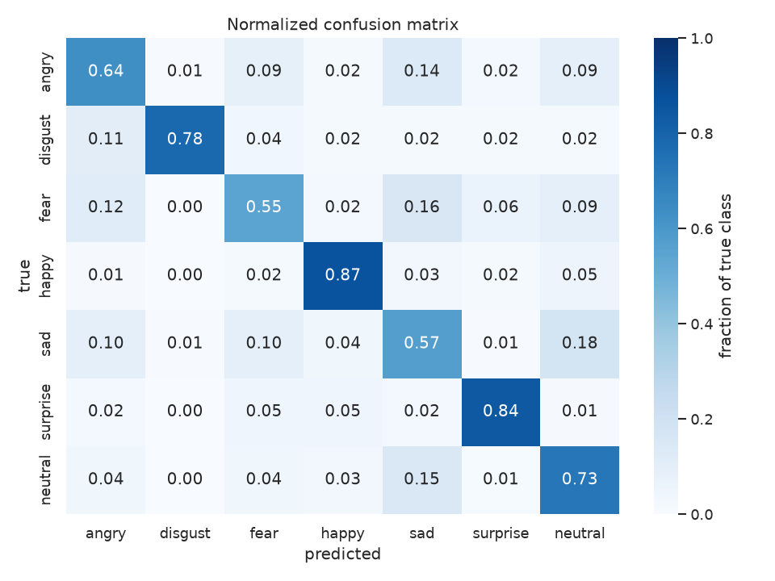
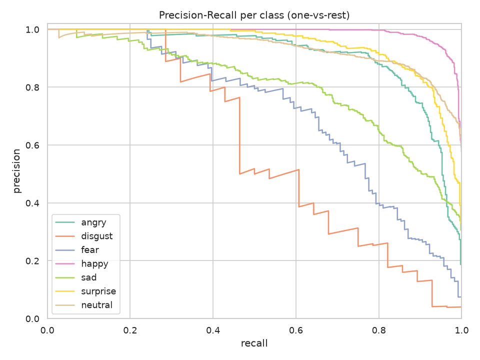
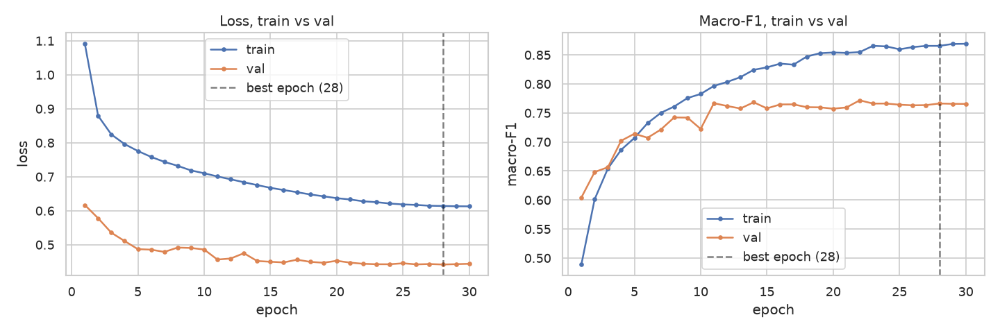
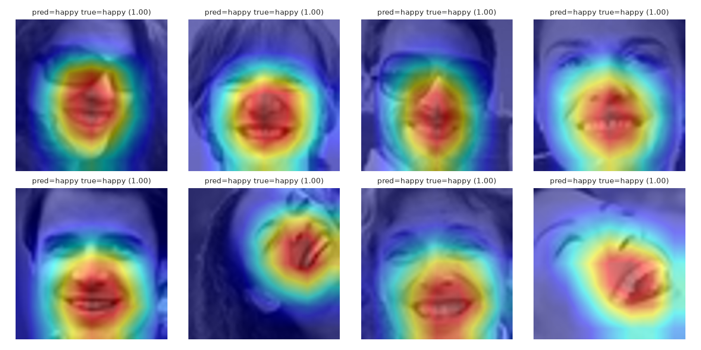
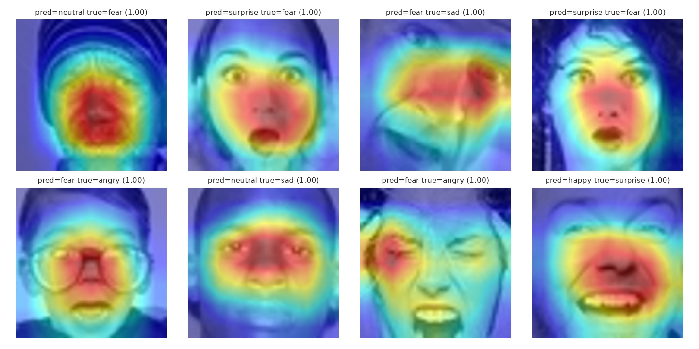
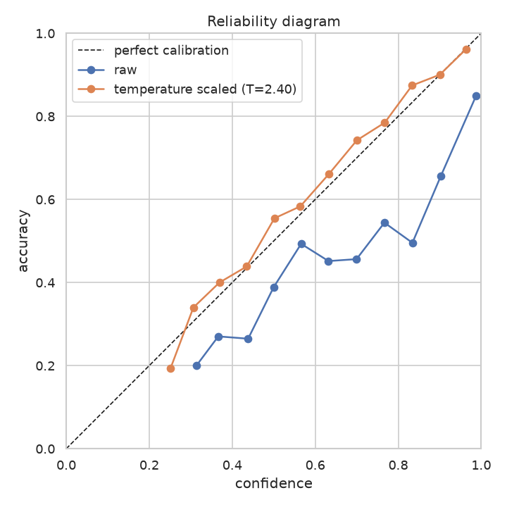

# FER-2013

Facial expression recognition on the [FER-2013](https://www.kaggle.com/datasets/deadskull7/fer2013) dataset: a ResNet18 fine-tuned on 48x48 grayscale faces to classify one of seven emotions, with a full pipeline from raw CSV to trained model to evaluation report, and a torch-free FastAPI service that serves the model with face detection and Grad-CAM++ explanations.

## Emotions

`angry`, `disgust`, `fear`, `happy`, `sad`, `surprise`, `neutral`

## Pipeline

1. **Download**: fetch `fer2013.csv` from Kaggle.
2. **Preprocess**: parse the CSV into `.npy` arrays, split into train/val/test.
3. **Train**: fine-tune an ImageNet-pretrained ResNet18 with a weighted sampler and weighted loss to counter class imbalance, early stopping on validation macro-F1.
4. **Evaluate**: run the best checkpoint on a split, produce metrics, a confusion matrix, and precision-recall curves.
5. **Explain**: run Grad-CAM++ on the same checkpoint to see which regions of the face drive correct and incorrect predictions.
6. **Calibrate**: fit a single temperature on the validation split so the reported confidences match how often the model is right.
7. **Serve**: export the checkpoint to ONNX and run it behind a FastAPI app (see [API](#api)). The service detects faces in a photo, classifies each one and can return the Grad-CAM++ heatmap, without PyTorch in the runtime image.

## Setup

Requires Python 3.12 and [uv](https://docs.astral.sh/uv/).

```bash
uv sync
```

`uv sync` installs everything, including the dev tools. The API image installs only the `serve` dependency group (no PyTorch); `export` adds `onnx` for exporting a checkpoint.

To download the dataset yourself, add Kaggle credentials to a `.env` file (see `.env.example`):

```
KAGGLE_USERNAME=your-username
KAGGLE_API_TOKEN=your-token
```

## Usage

```bash
# 1. Download the raw CSV
uv run python scripts/download_data.py --csv-path data/raw/

# 2. Preprocess into train/val/test arrays
uv run python scripts/preprocess_data.py --csv-path data/raw/fer2013.csv --out-dir data/processed/

# 3. Train
uv run python scripts/train.py --config configs/default.yaml

# Override any config value from the command line
uv run python scripts/train.py --config configs/default.yaml --set training.epochs=5 --set data.batch_size=128

# 4. Evaluate the best checkpoint on the test set
uv run python scripts/evaluate.py --checkpoint checkpoints/best.pt --split test

# 5. Explain predictions with Grad-CAM++
uv run python scripts/gradcam_report.py --checkpoint checkpoints/best.pt --split test

# 6. Calibrate the confidences (writes reports/calibration.json and a reliability diagram)
uv run python scripts/calibrate.py --checkpoint checkpoints/best.pt

# 7. Export to ONNX for the API with that temperature (see the API section)
uv run python scripts/export_onnx.py --checkpoint checkpoints/best.pt --out-dir models/ --calibration reports/calibration.json
```

Training writes checkpoints to `checkpoints/`, TensorBoard logs to `runs/`, and a per-epoch history JSON to `reports/`. View training progress with:

```bash
uv run tensorboard --logdir runs
```

Evaluation writes metrics, prediction arrays, and plots (confusion matrix, PR curves, training curves) to `reports/`.

## Configuration

Training is driven by a YAML config (`configs/default.yaml`):

```yaml
data:
  processed_dir: data/processed
  batch_size: 64
  num_workers: 4

model:
  num_classes: 7
  pretrained: true

training:
  epochs: 30
  lr: 1.0e-4
  weight_decay: 1.0e-4
  early_stopping_patience: 5
  early_stopping_metric: macro_f1
  early_stopping_mode: max
  seed: 42

checkpoint:
  dir: checkpoints
  save_best: true
  save_last: true

tensorboard:
  enabled: true
  log_dir: runs
  run_name: fer2013_resnet18
```

Any field can be overridden per run with `--set section.field=value` (see Usage above).

## Results

Latest run: trained 2026-10-01 with the training code at `a672782` and the default seed (42), the same code and seed as the previous run, which this one replaces. It ran all 30 epochs without triggering early stopping; the best validation macro-F1 of **0.6842** was reached at epoch 28.

### Test set

| Metric   | Value  |
|----------|--------|
| Accuracy | 0.7074 |
| Macro-F1 | 0.7090 |

The previous run with the same code and seed scored 0.7122 and 0.7153. Training only calls `torch.manual_seed` and does not enable deterministic CUDA kernels, so runs are not bit-reproducible, and with 3,589 test images the standard error of the accuracy is about 0.8 points. A gap of half a point between two single runs is within that noise; averaging several seeds would be needed to tell real changes from it.

### Per-class (test set)

| Emotion  | Precision | Recall | F1    | Support |
|----------|-----------|--------|-------|---------|
| angry    | 0.626     | 0.646  | 0.636 | 491     |
| disgust  | 0.840     | 0.764  | 0.800 | 55      |
| fear     | 0.590     | 0.589  | 0.590 | 528     |
| happy    | 0.910     | 0.866  | 0.887 | 879     |
| sad      | 0.565     | 0.544  | 0.554 | 594     |
| surprise | 0.808     | 0.820  | 0.814 | 416     |
| neutral  | 0.657     | 0.709  | 0.682 | 626     |

`sad` (F1 0.554) and `fear` (0.590) are the weakest classes. `sad` is mostly mistaken for `neutral` (18% of its samples), `angry` (12%) and `fear` (11%); `fear` for `sad` (15%) and `angry` (11%). `happy` (0.887) and `surprise` (0.814) are the strongest. `disgust` scores 0.800 but has by far the smallest support (55 test samples), so its F1 is noisier than the others.







The model overfits: validation loss is lowest at epoch 4 (1.03) and climbs to 1.48 while training loss falls to 0.05, and the final training accuracy is 0.959 against 0.690 on validation. Validation macro-F1 keeps creeping up and plateaus around 0.68 from epoch 22 on, which is why early stopping on that metric never fires. Stronger regularization or earlier stopping on validation loss are the obvious next experiments.

Regenerate this table and these plots for a new run with:

```bash
uv run python scripts/evaluate.py --checkpoint checkpoints/best.pt --split test
```

which writes `reports/test_metrics.json` and fresh plots to `reports/`. `reports/` itself is not tracked; to update the images above, copy the new PNGs into `docs/images/` and commit them.

### Grad-CAM

Grad-CAM++ heatmaps over `model.layer4`, on the logit of the predicted class, for the 8 most confident correct predictions and the 8 most confident misclassifications on the test set.



Correct predictions concentrate on the mouth and nose, with the eyebrows and eyes also lit up for `angry` and `disgust`: the central face region that carries most of the expression.



The confident mistakes are mostly `fear` and `sad`/`angry` samples. Several involve an open mouth (`fear` read as `surprise`), glasses, a tilted or partly out-of-frame face, or a wink, where the heat lands on the glasses rim or on one eye instead of the whole expression. That is consistent with `fear`, `sad` and `angry` being the weakest and most-confused classes above.

Regenerate with:

```bash
uv run python scripts/gradcam_report.py --checkpoint checkpoints/best.pt --split test
```

### Calibration

The model is overconfident: on the test set 38.3% of its predictions come with a confidence above 0.99, and its mean confidence is 0.876 against a 0.707 accuracy. Temperature scaling divides the logits by one scalar before the softmax, which changes the confidences but never the predicted class, so accuracy is untouched. The temperature is fitted on the validation split only (T = 2.40, 3,589 images) and evaluated on the test set.

| Split | Probabilities | Accuracy | ECE | NLL | Brier | Mean confidence |
|-------|---------------|----------|-----|-----|-------|-----------------|
| val | softmax | 0.688 | 0.185 | 1.319 | 0.491 | 0.873 |
| val | T = 2.40 | 0.688 | 0.016 | 0.917 | 0.434 | 0.684 |
| test | softmax | 0.707 | 0.168 | 1.209 | 0.461 | 0.876 |
| test | T = 2.40 | 0.707 | 0.022 | 0.867 | 0.415 | 0.687 |

ECE is the expected calibration error of the top-label confidence over 15 bins; NLL and Brier are proper scoring rules, lower is better. After calibration the confidence tracks accuracy: in the exported model's test predictions, accuracy is 0.939 when confidence is at least 0.9 (725 images), 0.835 between 0.7 and 0.9 (1,095), 0.630 between 0.5 and 0.7 (939) and 0.427 below 0.5 (830).



Limits: a single temperature cannot fix everything. The middle of the curve ends up slightly under-confident, and training used balanced sampling, so per-class biases from that prior shift are not corrected. The calibration holds for data like FER-2013's validation split, not necessarily for photos from another population.

Regenerate with:

```bash
uv run python scripts/calibrate.py --checkpoint checkpoints/best.pt
```

## API

A FastAPI service wraps the trained model: upload a photo, get one result per detected face (box, emotion, probabilities and, on request, a Grad-CAM++ heatmap). Inference runs on ONNX Runtime, so the image has no PyTorch in it.

```bash
curl -F "file=@photo.jpg" "http://localhost:7860/predict?explain=true"
```

```json
{
  "image": {"width": 640, "height": 480},
  "faces": [{
    "box": {"x": 120, "y": 80, "w": 96, "h": 96},
    "emotion": "happy",
    "confidence": 0.93,
    "probabilities": {"angry": 0.01, "disgust": 0.0, "fear": 0.01, "happy": 0.93, "sad": 0.01, "surprise": 0.02, "neutral": 0.02},
    "gradcam": "<base64 PNG, null unless explain=true>"
  }],
  "timings_ms": {"detect": 12.0, "classify": 35.0, "total": 52.0}
}
```

`probabilities` and `confidence` are calibrated (see Calibration). `GET /` is a small demo page, `GET /docs` the OpenAPI UI, `GET /health` reports the loaded model hash and its calibration temperature (`null` for models exported before calibration existed). Faces are found with [YuNet](https://github.com/opencv/opencv_zoo/tree/main/models/face_detection_yunet) (MIT).

### Run it

```bash
# export the trained checkpoint (needs torch) and fetch the face detector
uv run python scripts/export_onnx.py --checkpoint checkpoints/best.pt --out-dir models/
ONLY_YUNET=1 scripts/fetch_models.sh models serving/models.sha256
MODELS_DIR=models uv run uvicorn fer_2013.serving.api:create_app --factory --port 7860
```

Or with Docker, which downloads the models from a GitHub Release and verifies their sha256 at build time:

```bash
docker build -t fer-api .
docker run --rm -p 7860:7860 fer-api
```

To publish a new model: run `scripts/calibrate.py` and the export with `--calibration`, `gh release create models-vX.Y.Z models/fer_resnet18.onnx models/fer_fc_weight.npy` (model releases use `models-v*` tags so they don't trigger the app's `v*` deploy; bump major when the serving contract changes, such as architecture, input normalization or labels, minor for a retrain, patch for a re-export), append their `sha256sum` lines to `serving/models.sha256`, and point `RELEASE_URL` in the `Dockerfile` at the new tag. CI tests, builds the image and smoke tests it. The image runs anywhere Docker does; the public demo is the [browser build](#browser-demo), which needs no server.

### Grad-CAM++ without PyTorch

The head is `avgpool -> Dropout -> Linear`, so in eval mode the gradient of a class logit with respect to the `layer4` activations is constant over space (`w_k / 49`). Plugging that into the Grad-CAM++ weights gives a closed form that needs only the activations and the `Linear` weights, both available from the ONNX model, so the API computes it in numpy. This holds only for this head, and it uses the raw logits and weights: dividing them by the calibration temperature would change the heatmap, so only the probabilities are calibrated. `tests/serving/test_gradcam.py` checks it against `pytorch-grad-cam` for every class (correlation above 0.999), and would fail if the architecture changed.

### Performance

The exported model reproduces the PyTorch one: through the ONNX Runtime pipeline with the serving preprocessing, the full test set scores 70.80% accuracy against 70.74% in PyTorch, and 99.94% of predictions are identical (2 of 3,589 differ).

Latency measured with `scripts/benchmark.py` against the Docker image (a 260x260 image with one face; `p50` / `p95` of the full request). On a 12th Gen Intel i5-12450HX with no CPU limit, 50 requests:

| Request            | p50 (ms) | p95 (ms) |
|--------------------|----------|----------|
| `explain=false`    | 22.9     | 27.6     |
| `explain=true`     | 26.0     | 32.8     |

Restricted to the size of a typical free hosting tier (`docker run --cpus 0.1 --memory 512m`, 15 requests, two repeated runs): about 1.8 to 2.0 s p50 without `explain` and 2.3 to 2.6 s with it, a boot of about 30 s, and 212 MiB of memory in use. It fits a 512 MB instance, but it is slow on a tenth of a core.

Classifier alone, one 224x224 image, 2 threads: ONNX Runtime 15.6 ms p50 versus PyTorch 24.1 ms. The Docker image is 742 MB on disk (330 MB of Python packages, 43 MB of models); an environment with PyTorch and its CUDA wheels is over 4 GB.

### Limitations and privacy

- The classifier reaches about 71% accuracy on FER-2013 (see Results), its confidences are calibrated on that dataset's validation split only, and it inherits the dataset's biases: acted or web-scraped expressions, uneven demographics, noisy labels. Emotion labels from a face are not a reliable read of how someone feels. Do not use this for decisions about people.
- The confidence moves with the crop: three copies of the same face in one image got 73.5%, 78.7% and 80.6% (the browser and Python agree on all three), because the detector boxes differ by a few pixels.
- Faces from a detector are cropped square with a 10% margin before classification. On 1,476 FER test faces upscaled 4x (98% of 1,500 detected), classifying the detector crop scores 68.9% against 69.5% for the original 48x48 image on the same faces, and margins from 0% to 40% all land between 68.6% and 68.9%. So the crop costs about 0.6 points and the margin hardly matters. This is a proxy built from FER faces, not a benchmark on real photos.
- Uploaded images are processed in memory and never written to disk or logged. Uploads are limited to 5 MB and JPEG, PNG or WebP.
- The service is public and unauthenticated; it caps concurrent work and answers `503` when busy.

## Browser demo

`web/` is a static site that runs the same pipeline in the browser: YuNet finds the faces, the ONNX classifier predicts the emotion with the calibrated probabilities, and Grad-CAM++ is computed in JavaScript. The photo never leaves the page. After the models load there are no network requests (the Network tab shows it). A Content-Security-Policy restricts the page itself; the worker that processes the pixels is same-origin code with no network calls, but GitHub Pages cannot send CSP headers for workers, so the browser does not enforce that part.

How it works:
- Plain ES modules, no bundler. `onnxruntime-web` runs in a Web Worker with WebAssembly and one thread, because GitHub Pages cannot send the headers that threads need.
- Every stage is tested in Node against golden files written by the Python pipeline (`scripts/make_web_golden.py`): resampling is byte-identical to Pillow, detector boxes match OpenCV (IoU at least 0.999), probabilities and Grad-CAM++ maps agree within 1e-4. A Python test fails when the golden files go stale, and the site build fails when the models differ from the ones the golden files were made for.
- The models are downloaded on first use, checked against their sha256 and kept in the browser cache, so later visits do not download them again.
- Measured in Chromium on a desktop, with one face: detection about 11 ms, classification about 100 ms, Grad-CAM++ about 4 ms; three faces take about 400 ms in total. A first visit downloads about 59 MB (the 45 MB model and the 14 MB runtime).
- A JPEG decoded by Chromium gives probabilities that differ from Pillow's by 6e-8 on the example photo, and the same box. Other browsers may decode JPEG slightly differently.

Build and run it locally:

```bash
cd web && npm ci && npm test && cd ..
WEB=1 RELEASE_URL=<models release url> scripts/fetch_models.sh models serving/models.sha256
node web/build.mjs --models models --out web/dist
python3 -m http.server -d web/dist 8000
```

The site is published to GitHub Pages from `main` by `.github/workflows/pages.yml`. Pages is free for public repositories, with a soft limit of 100 GB of bandwidth per month, which is on the order of 1,500 first visits.

## Development

```bash
uv run ruff check --fix .   # lint
uv run ruff format .        # format
uv run mypy                 # type check
uv run pytest -q            # tests
```

CI (`.github/workflows/ci.yml`) runs lint, format check, mypy and the tests on every push and pull request; once the model release exists it also builds the Docker image and smoke tests it with `scripts/smoke_test.sh`.

Pre-commit hooks run lint and format on commit, and type checking plus the full test suite on push:

```bash
uv run pre-commit install
```

## License

Released under the [GNU AGPL-3.0](LICENSE). The training data is the [FER-2013 mirror on Kaggle](https://www.kaggle.com/datasets/deadskull7/fer2013) (CC0); see [NOTICE](NOTICE) for third-party attributions.
