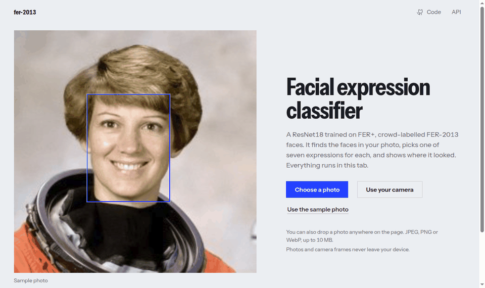

# FER-2013 images, FER+ labels

A ResNet18 that reads seven facial expressions, trained, calibrated, shrunk to 11 MB and running **entirely in your browser**, live from your camera, with a heatmap of where it looked.

**[Live demo](https://miguelmochizuki.github.io/fer-2013/)** · [API](#api) · [Results](#results) · [Limitations](#limitations-and-privacy)



## Highlights

| | |
|---|---|
| **Nothing leaves the tab** | Face detection, classification and Grad-CAM++ run in WebAssembly. Photo or live camera, every face at once. First visit downloads 26 MB. |
| **Accurate and honest** | 85.6% accuracy, 0.769 macro-F1 on the FER+ test set (the FER-2013 images with crowd-voted labels, [why](docs/results.md#why-fer)). Confidences are calibrated (ECE 0.092 to 0.021): when it says 90% or more, it is right 98% of the time. Rare classes (`disgust`, `fear`) are the weak spot and the results say so. |
| **Small and fast** | int8 quantization took the model from 44.7 MB to 11.3 MB and made it about 3x faster for a third of a point of accuracy. |
| **Torch-free API** | FastAPI on ONNX Runtime in a 365 MB distroless image (it was 742 MB): 13 ms per request, 92 MiB of memory. |
| **Reproducible** | Training is seeded: two runs on the same hardware give identical numbers. Every run records its config, git commit and a hash of each data array. |
| **Verified, not assumed** | The JavaScript port is tested against golden files from the Python pipeline: resizing is byte-identical to Pillow, detector boxes match OpenCV (IoU 0.999). |

## Try it

```bash
# in the browser: https://miguelmochizuki.github.io/fer-2013/

# the API
docker build -t fer-api . && docker run --rm -p 7860:7860 fer-api
curl -F "file=@photo.jpg" "http://localhost:7860/predict?explain=true"

# train it yourself (Python 3.12, uv)
uv sync
```

## How it works

```
photo or camera frame
  -> YuNet face detector (230 KB, ONNX)
  -> square crop with 10% margin, grayscale, 224x224
  -> ResNet18, int8 (ONNX): logits, layer4 features, calibrated probabilities
  -> Grad-CAM++ from the features and the final layer's weights (closed form, no autograd)
```

The same four steps run in Python (`src/fer_2013/serving`) and in JavaScript (`web/src`). Training:

```bash
uv run python scripts/download_data.py --csv-path data/raw/                 # FER-2013 images; needs Kaggle credentials in .env
curl -L -o data/raw/fer2013new.csv https://raw.githubusercontent.com/microsoft/FERPlus/master/fer2013new.csv   # FER+ labels
echo "9206e20d62f56475939f516847d61753e4860caeac9718b560129541b776fc2c  data/raw/fer2013new.csv" | sha256sum -c
uv run python scripts/preprocess_data.py --csv-path data/raw/fer2013.csv --ferplus-csv data/raw/fer2013new.csv --out-dir data/processed_ferplus/
uv run python scripts/train.py --config configs/default.yaml                # the shipped recipe; writes checkpoints/ferplus/
uv run python scripts/evaluate.py --checkpoint checkpoints/ferplus/best.pt --processed-dir data/processed_ferplus --split test
uv run python scripts/gradcam_report.py --checkpoint checkpoints/ferplus/best.pt --processed-dir data/processed_ferplus --split test
uv run python scripts/calibrate.py --checkpoint checkpoints/ferplus/best.pt --processed-dir data/processed_ferplus   # temperature scaling on the validation split
uv run python scripts/export_onnx.py --checkpoint checkpoints/ferplus/best.pt --out-dir models/ --calibration reports/calibration.json
mv models/fer_resnet18.onnx models/fer_resnet18_fp32.onnx
uv run python scripts/quantize_onnx.py --model models/fer_resnet18_fp32.onnx --out models/fer_resnet18.onnx --data-dir data/processed_ferplus
```

Each run writes its checkpoints to `checkpoints/<run name>/` and a `reports/history_*.json` with the config, the git commit and a sha256 per data array. The seed is fixed and cuDNN is deterministic, so the same hardware gives the same run to the digit (another GPU or driver can differ slightly). `configs/fer2013.yaml` is the recipe of the previous model, on the original labels.

Override any config value with `--set section.field=value` (see `configs/default.yaml`).

## Results

| | FER+ test accuracy | Macro-F1 | ECE | Size | One image |
|---|---|---|---|---|---|
| fp32 | 0.859 | 0.770 | 0.021 | 44.7 MB | 15.6 ms |
| **int8 (shipped)** | **0.856** | **0.769** | **0.015** | **11.3 MB** | **5.3 ms** |

`happy` (F1 0.94), `neutral` (0.87) and `surprise` (0.87) are read well; `disgust` (0.55, only 28 test images) and `fear` (0.59) are the weak spots: rare in training and under-predicted, `fear` mostly taken for `surprise`. Temperature scaling (T = 0.674, fitted on validation only; this model is under-confident) cut the expected calibration error from 0.092 to 0.021 without changing a single prediction.

**Why FER+ labels.** FER+ re-labels the FER-2013 images by a vote of about 10 annotators, and only about 65% of its labels equal the original ones (17% for `fear`). On the original FER-2013 test labels this model scores 61.2%, and the previous model, trained on them, 70.7%: different targets, so the two numbers are not comparable. [The comparison, the paper's 84 to 85% and the recipe that got there](docs/results.md#why-fer).

<p>


</p>

Per-class numbers, Grad-CAM++ examples, the overfitting analysis, calibration and quantization details: [docs/results.md](docs/results.md).

## Engineering notes

- **The int8 model that was wrong only on some CPUs.** The first quantization looked perfect on my machine and was off by 0.26 in probability on a GitHub runner: AVX2 CPUs without VNNI saturate an int16 intermediate. A golden-file test caught it; a 7-bit range makes the results bit-identical on both. [Details](docs/results.md#quantization).
- **OpenCV out of the image.** YuNet's decoding and NMS are a few dozen lines of numpy, tested against `cv2.FaceDetectorYN`. The same algorithm powers the browser detector.
- **Closed-form Grad-CAM++.** The head is `avgpool -> dropout -> linear`, so the gradients are constant over space and the heatmap needs only the activations and the weights. [Why it works](docs/api.md#grad-cam-without-pytorch).
- **Live camera.** A tracker keeps face numbers between frames and smooths probabilities with an exponential average, because the confidence can move with a few pixels of crop (up to 29 points in the worst case measured). [Browser demo](docs/browser-demo.md).
- **Free, permanent hosting.** The demo is a static site on GitHub Pages; there is no server to pay for or to keep alive.

## API

```bash
curl -F "file=@photo.jpg" "http://localhost:7860/predict?explain=true"
```

One result per detected face: box, emotion, calibrated probabilities and, with `explain=true`, a base64 Grad-CAM++ PNG. `GET /` is a demo page, `GET /docs` the OpenAPI UI, `GET /health` the loaded model hash. Run it without Docker, response format, latency tables: [docs/api.md](docs/api.md).

## Limitations and privacy

- About 86% accuracy on FER+ labels, 61% on the original FER-2013 labels, over acted and web-scraped faces with noisy annotations; `disgust` and `fear` are under-predicted. Emotion labels read off a face are not a reliable read of how someone feels: do not use this for decisions about people.
- The model was trained on 48x48 grayscale faces. A webcam in poor light or at an angle is read worse than the test set suggests, and `neutral` tends to win.
- Confidences move with the crop: on upscaled test faces a 2 px shift of the box changes the top confidence by 0.2 points on average and by up to 29 in the worst case. Small faces in a large crowd photo can be missed (detection runs at up to 640 px).
- Uploads are processed in memory and never written to disk or logged; the browser demo sends nothing anywhere. The page is under a strict CSP; the worker that touches the pixels is same-origin code with no network calls, but GitHub Pages cannot send CSP headers for workers, so the browser does not enforce that part.

More: [docs/browser-demo.md](docs/browser-demo.md#limitations-and-privacy).

## Project organization

```
src/fer_2013/
  data/ training/ evaluation/   download, train (Pydantic config, early stopping), metrics, Grad-CAM++, calibration
  models/                       ResNet18, ONNX export, int8 quantization (needs torch; local only)
  serving/                      torch-free runtime: preprocess, YuNet, classifier, Grad-CAM++, FastAPI
web/                            the static site: ES modules, worker, tests against Python golden files
scripts/                        thin CLIs over the package; fetch_models.sh, smoke_test.sh
tests/  web/tests/              pytest and node:test (the site is tested against Python golden files)
docs/                           results, API and browser-demo deep dives
serving/models.sha256           pinned hashes of every model the image and the site download
```

**Stack:** Python 3.12 and [uv](https://docs.astral.sh/uv/), PyTorch (training only), ONNX Runtime, FastAPI, OpenCV (tests only), Docker (distroless), onnxruntime-web, GitHub Actions and Pages.

## Releases

`v*` tags are the application; `models-v*` tags are the trained weights, published as **pre-releases on purpose**: the Dockerfile, CI and the site download from them, so they must stay. Model versions: major for a contract change (a different input, preprocessing, output name or class set or order), minor for a retrain or re-quantization (the meaning of the labels can change, as it did in v1.3.0: say so in the release notes), patch for a re-export.

## Development

Code is documented in Google-style docstrings (Python) and JSDoc (JavaScript); the rules and examples are in [CONTRIBUTING.md](CONTRIBUTING.md).

```bash
uv run ruff check --fix . && uv run ruff format .   # lint and format
uv run mypy                                         # strict type check
uv run pytest -q                                    # python tests
npm test --prefix web                               # site tests
uv run pre-commit install                           # ruff + mypy on commit, tests on push
```

## License

[MIT](LICENSE) from v0.2.0 (v0.1.0 and v0.1.1 were published under the AGPL-3.0 and stay under it). The images are the [FER-2013 mirror on Kaggle](https://www.kaggle.com/datasets/deadskull7/fer2013) (CC0) and the labels are [FER+](https://github.com/microsoft/FERPlus) (Microsoft, MIT; Barsoum et al., ICMI 2016); third-party attributions are in [NOTICE](NOTICE).
